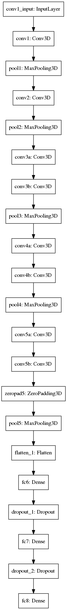
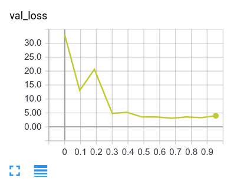

This is a proposal to solve the speed prediction challenge posted by https://comma.ai/. We use 3D Convolutional Network [1] to predict car speed using dashcam footage. 3D Convolutional Network seems to be the perfect solution for this problem as the MSE on the validation dataset reduces to 4.8 after 4 epoches while LSTM for video understanding [2] gets stuck at 70 MSE after 8 epoches. The trained network is good enough to make reasonable prediction on arbitrary footages.

**The final mean squared error on validation set is 3.1!**

This is the results on the validation footage:

<a href="https://www.youtube.com/watch?v=384IEndkPYc" rel="some text">

</a>

This is the results on a random dashcam camera:

<a href="https://www.youtube.com/watch?v=67a-iTXKlKY" rel="some text">

</a>

[1] Learning Spatiotemporal Features with 3D Convolutional Networks (https://arxiv.org/abs/1412.0767)

[2] Unsupervised Learning of Video Representations using LSTMs (https://arxiv.org/abs/1502.04681)

Take a look at a similar attempt at https://github.com/JonathanCMitchell/speedChallenge

# Information

Network architecture

Validation losses

# Usage

1. Download the weights pretrained on the Sports-1M dataset [https://goo.gl/tsEUo2]

2. Download the training data from comma.ai website [https://goo.gl/ERi7Uh]

3. Follow the steps in "Dashcam Speed - C3D.ipynb" for a walk-through of the training and testing of the network

# Todo list

1. Use shorter look-back time window to allow more fine-grained speed prediction. At the moment, the network looks 16 frames back in time and predicts the average speed during this period.
2. Use semantic segmentation to cut off moving objects. Moving objects such as vehicles confuses the speed prediction w.r.t. the road. More data with diverse conditions may also be able to clear this issue.